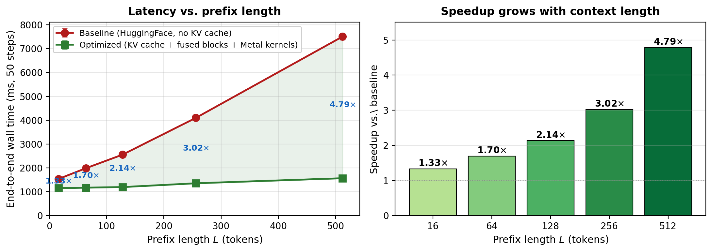

# Optimizing Hybrid Diffusion-Autoregressive Inference on Metal

CS 5220 final project, Spring 2026. An inference-optimization study of STAR-LDM ([Lovelace et al., COLM 2025](https://openreview.net/forum?id=c05qIG1Z2B)) on the Apple M-series Metal/MPS backend. Custom Metal kernels, KV-cache amortization, a streamlined GPT-2 forward, and a closed-form fused v+DDPM step.

> This repo is based on [STAR-LDM](https://github.com/justinlovelace/STAR-LDM). The Metal kernels, KV-cache plumbing, fused ops, benchmarks, and all measurement infrastructure are this project's work. **See [`CONTRIBUTION.md`](CONTRIBUTION.md) for a file-by-file map.**

**Result:** end-to-end inference speedup grows with prefix length, reaching **4.79× at L=512** tokens on a single Apple M4 Max, with no quality regression.

## Contents

- `star_ldm/kernels/`: seven custom Metal compute shaders with Obj-C++ dispatch wrappers (four production, three research artifacts).
- `star_ldm/diffusion/fused_ops.py`, `star_ldm/models/modules/fused_blocks.py`: Python integration. JIT fallbacks and the `FusedAttention` / `FusedFeedForward` module swap.
- `star_ldm/models/transfusion.py`: adds `_fast_gpt2_forward`, `sample_with_kv_cache`, and the KV-cache buffer-prep helpers on top of upstream STAR-LDM.
- `scripts/`: benchmarks (`eval_c4_canonical.py`, `bench_e2e_phase2.py`), profilers, figure-generation scripts.
- `results/`: canonical benchmark JSONs with 95% CIs.
- `figures/`: publication figures.
- `CONTRIBUTION.md`: file-by-file authorship map. What is this project's work vs. upstream STAR-LDM.

## Pretrained checkpoint

The STAR-LDM checkpoint (GPT-2 Large + diffusion planning, trained on FineWeb-100B, ~6 GB): [Download](https://cornell.box.com/s/09kp1l61cmnejixpywqvg5vauoq8sih1). Extract to `checkpoints/star-ldm/`.
